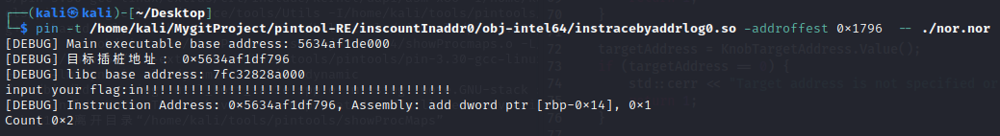
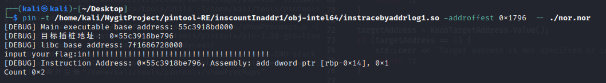

# 环境要求

# inscountInaddr0 : 
// 注册Instruction函数以便插装指令
INS_AddInstrumentFunction(Instruction, 0);
通过对每条汇编指令插入回调函数来实现程序插桩，INS_InsertCall

# inscountInaddr1 : 
//速度更快！
// 注册Trace函数以便插装指令
TRACE_AddInstrumentFunction(Trace, 0);
通过对程序的基本块插入回调函数，来实现对每条汇编指令的插桩，BBL_InsertCall
